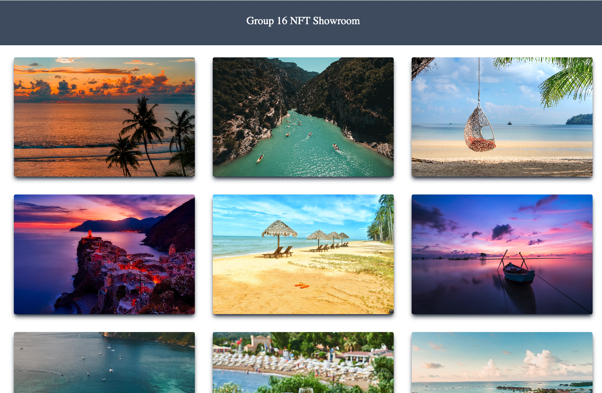

# Week 4 Weekend Project

* Build a web server and API for providing the features using the RESTful architecture
* Run a local node of IPFS
* Upload 10 images to this node
* Create a JSON and build metadata descriptions for 10 NFTs, each using one unique image
* Make a GET method in the API to get the metadata by id
* Deploy a NFT Collection and mint 10 NFTs, and assign the API endpoint to the token URI
* Integrate this NFT Collection contract and APIs in a frontend application to display NFTs metadata and images
* (Bonus) provide wallet functions in the frontend to buy, transfer, allow, transfer from and burn NFTs

### Create Frontend using NextJS

1. Initialise the NextJS folders with Typescript and TailwindCSS

```
npx create-next-app --example nft-showroom with-tailwindcss-app

```
### Retrieve Image and Name from Endpoint

2. Retrieve API data

```
export async function getServerSideProps() {

  //fetch NFT metadata
  const res = await fetch(`http://localhost:8000/nfts/metadata`, {
    method: "GET"
  });
  const data = await res.json();
  // Pass data to the page via props
  return { props: { data } }
}

```
### Run localhost to display on frontend

5. Make sure ipfs is connected (``ipfs daemon``) and api server is running (``yarn start`` from api folder) 
* Run ``yarn dev`` to start localhost and display images on the frontend


